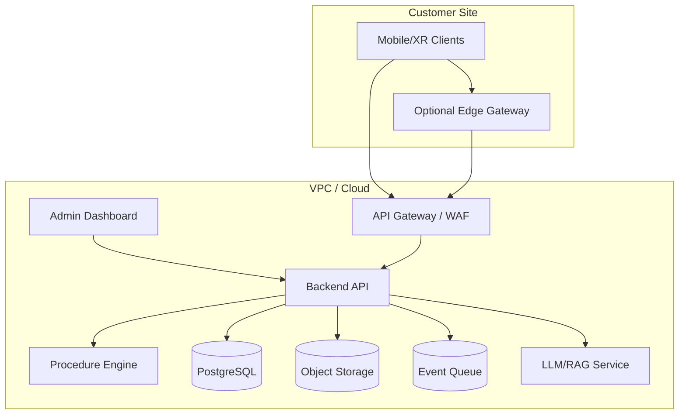

# Deployment Architecture

## SaaS Standard

## Enterprise / Regulated Deployment

- 고객 VPC 또는 온프레미스에 API, DB, Object Storage, Inference Gateway 배포
- 인터넷 연결 제한 환경에서는 모델 업데이트와 패치만 승인된 경로로 반입
- 로그는 고객 SIEM으로 전달
- 증적 보관은 고객 정책에 따라 WORM storage 또는 장기보관 스토리지 사용

## Edge Gateway Sizing 예시

| 규모 | 동시 세션 | 추론 장치 | 비고 |
|---|---:|---|---|
| Lab Small | 5~20 | CPU/GPU 소형 서버 | PPE/라벨 중심 |
| Factory Cell | 20~100 | GPU 1~2장 | 실시간 부품/나사 검사 |
| Plant | 100+ | GPU cluster | 다중 라인/카메라 |

## Network Pattern

- Client → Edge: LAN, WebRTC/gRPC/HTTP snapshot
- Edge → Cloud: HTTPS, event/evidence metadata
- Cloud → Dashboard: HTTPS/WebSocket
- Cloud → Enterprise Systems: REST/Webhook/MQTT/OPC-UA adapter
