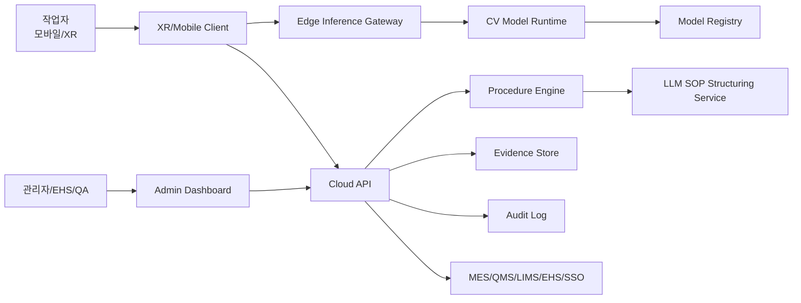

# System Context

## Context Diagram

## 주요 경계

### Device Boundary
- 모바일 브라우저, 태블릿, XR 글래스
- 카메라 프레임 처리, 로컬 캐시, 오프라인 큐

### Edge Boundary
- 현장 내부 네트워크에 설치되는 inference gateway
- 민감 영상의 외부 전송 최소화
- 저지연 추론과 모델 캐싱

### Cloud Boundary
- 테넌트 관리, SOP 버전관리, 대시보드, 리포트, 감사 로그
- LLM 기반 SOP 구조화와 검색
- 데이터 분석과 모델 모니터링

### Enterprise Integration Boundary
- MES/QMS/LIMS/EHS 연동
- SSO/SAML/OIDC
- SIEM, DLP, MDM 연동

## 설계 원칙

- 영상 원본은 기본적으로 현장/엣지에 보관하고, 클라우드에는 증적 스냅샷과 메타데이터 중심 저장
- LLM은 안전 판정의 최종 결정자가 아니라 절차 구조화, 설명, 리포트 생성 보조 역할
- Critical decision은 deterministic rule + confidence policy + human approval 조합으로 처리
- 모든 이벤트는 append-only audit log로 저장
