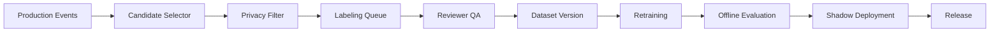

# Active Learning Loop

## 우선 라벨링 대상

1. Critical 단계에서 confidence가 낮은 이미지
2. 작업자가 override한 이벤트
3. 관리자 재분류 이벤트
4. 새 설비/부품/시약 도입 후 발생한 unknown 객체
5. 특정 현장에서 false alarm이 급증한 케이스
6. 조명/가림/반사/장갑 등 hard condition 케이스

## Workflow

## Governance

- 고객별 데이터 사용 동의 범위를 명확히 구분한다.
- 다른 고객 모델 학습에 데이터 재사용 시 별도 계약과 비식별화가 필요하다.
- 데이터셋 버전은 삭제/보존 정책과 연결한다.
- 모델 성능 개선은 release note로 고객에게 제공한다.
