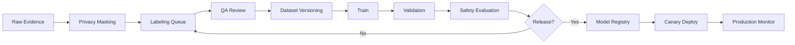

# Training Pipeline

## Pipeline Steps

## Release Gates

| Gate | 기준 |
|---|---|
| Dataset completeness | 필수 클래스/현장/조명 케이스 포함 |
| Critical recall | 목표 recall 이상 |
| Hard negative false alarm | 허용 범위 이하 |
| Latency | Edge device 목표 이내 |
| Bias/coverage | 특정 현장/작업자/조명 성능 저하 없음 |
| Rollback | 이전 모델로 즉시 복귀 가능 |

## Evaluation Metrics

- mAP@0.5, mAP@0.5:0.95
- class-wise precision/recall/F1
- critical false negative rate
- step-level pass/fail accuracy
- alert latency
- human override rate
- retake rate

## Canary Deployment

- 1개 현장/1개 SOP/낮은 위험 단계부터 시작
- 새 모델과 기존 모델 결과를 shadow mode로 비교
- safety critical 단계는 일정 기간 human review 병행
- rollback trigger: critical FN, latency spike, override spike
